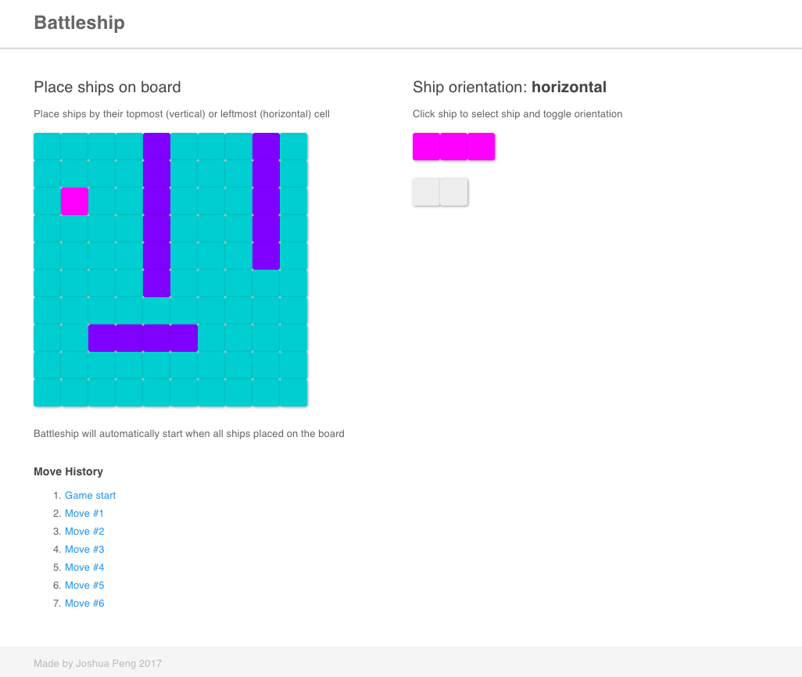
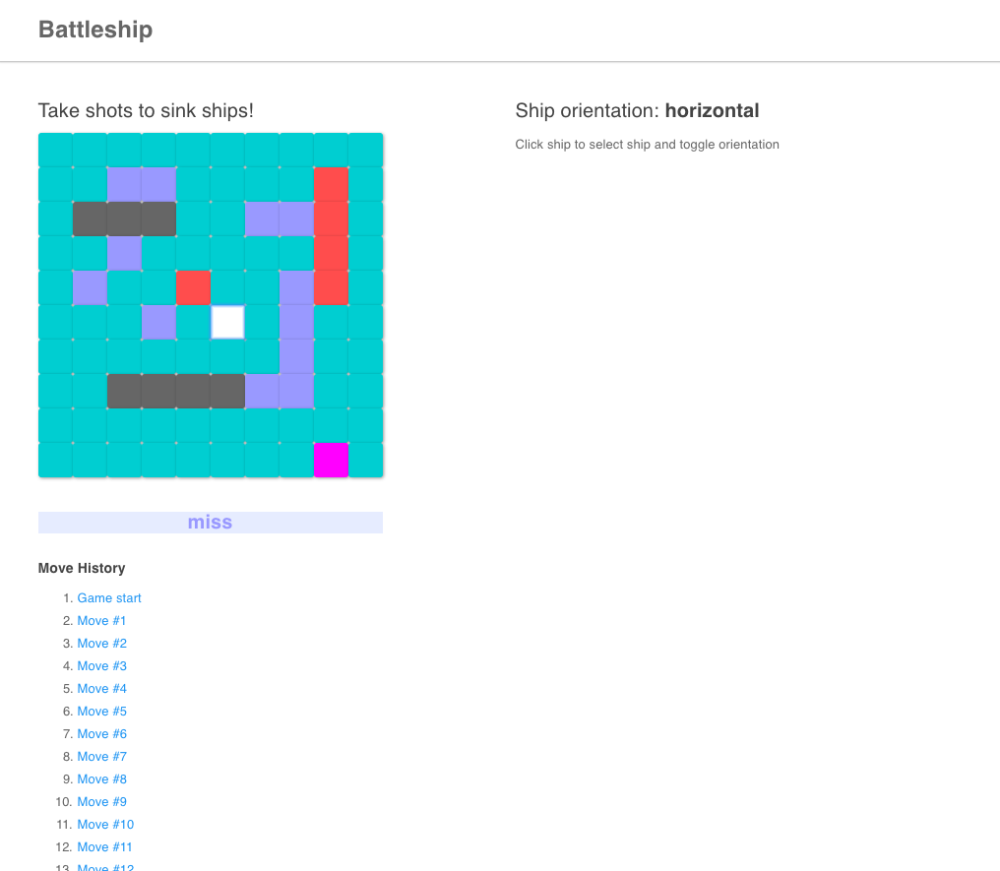
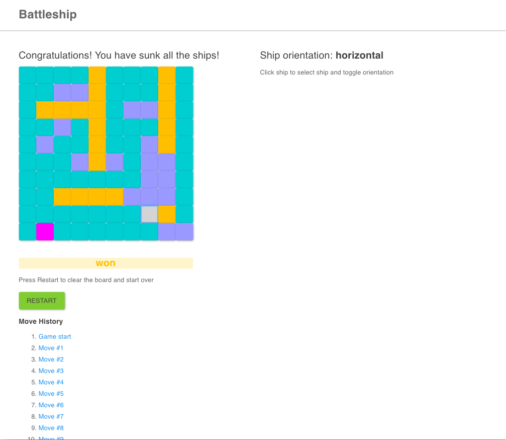

## Battleship

For this coding challenge you'll build a simplified version of battleship. You'll have 3 ships that will be placed on a 10 by 10 grid which is the battleground. Each cell in the battleground is identified by its space on an x,y axis with [0,0] being the cell in the bottom left corner. Each ship is 1 cell wide and 3 cells long. On initial placement, each ship is oriented vertically. To initialize the playing field you'll receive a 2 dimensional array where each element in the array contains the x,y coordinates of each ship's topmost cell.

For instance, one sample initialization could be `[[1,3],[2,4],[3,5]]`.

Your game interface will be a basic HTTP API. You will implement two endpoints `POST /create-game` and `POST /make-move`. `/create-game` will take the two dimensional initialization array as input and create a gameboard based on the array. `/make-move` will take an array as input (e.g. [x,y]) and will output whether or not the coordinates were a hit. If the hit sunk a ship, the API will respond with `sunk`. If the hit sunk all of the ships, the API will respond with `won`. If the hit was a regular hit, the API will just respond with `hit`. You will have to maintain state somehow in your application. The sample app is set up partially to use MongoDB, but you can use whatever persistence mechanism you prefer.

Please unit test your code and make sure all of your tests pass before submitting. Bonus points if you can design a UI to interface with the API.

## Submission

- You must first create a new branch off of the master branch (you cannot push to the master branch). This requires you to create a Gitlab account.
- You do not have to use the provided template, but it may help as it has already been set up with a testing framework and structure for setting up api endpoints.
- Upon completion, submit finished work as a merge request. Please include setup instructions if you do not use the provided template.

---
---

## Battleship

##### A single player battleship game with a full featured API and move history made with React, Express, and MongoDB. Complete with Mocha/Chai unit tests and Selenium Webdriver end-to-end tests.  
  
I created a single player battleship game according to the specifications above. I did not use the provided template, but instead used my own. I made the frontend client with React using create-react-app to create a starting scaffold and React-Bootstrap for UI and styling. I built the backend API with Node using the Express framework and persisted state and data with a MongoDB database. I created unit tests with Mocha and Chai and end-to-end tests with Selenium Webdriver.

## Technology

#### *Frontend*
- React
- React-Bootstrap
- Axios

#### *Backend*
- Node
- Express

#### *Database*
- MongoDB
- Mongoose

#### *Testing*
- Mocha
- Chai
- Selenium Webdriver (chromedriver)

## Design Decisions  

I made this app with React to conveniently manage state in the main `Game` component and for the helpful developer tools (in the browser console) that provide real time access to state variables. React also provides increased performance by writing out a full render virtually, and then checking the difference between the virtual render and what’s actually on the DOM and creating a patch. I only needed to manage state in the main `Game` component (not across the whole app), only had a few components, and the data flow (via props) across the app was fairly simple, so I did not think it was necessary to incorporate Flux or Redux.

## How To Play  

#### *Phase 1: Placing ships on the board*  
- Select ships (on the right) by clicking on them (any of the squares).
    - Carrier: 1x6
    - Battleship: 1x5
    - Cruiser: 1x4
    - Submarine: 1x3
    - Destroyer: 1x2
        - Can modify ship lengths by adjust the ship length constants at the top of the `Game` component
        - Ships can be the same or different lengths
        - Ships lengths must be between 1 and 10 to fit on the board
- Place ships on the board (on the left) by clicking on a square in the 10x10 grid.
- The highlighted square will be the topmost (if oriented vertically) or leftmost (if oriented horizontally) cell of the ship.
- To toggle ship orientation (vertical or horizontal), users click on any of the ships.
- When all ships have been placed on the board, the app transitions to the next phase.

### Methods (client/src/Game.js) and API (server/app.js)  

#### *createBoard*   
I had trouble saving a 2D array in the MongoDB database, so the board is saved as a single dimension 1x100 array instead. I adjusted the methods and my API to accept both coordinate pairs (for a 2D array grid) and indices (for a 1D array grid) as inputs. `createBoard` will make an API call to `POST /create-board` to generate a new 10x10 grid of zeroes (which is actually a 1D array rendered as a 2D grid), save it in the database, and pass it to the client via the response. `createBoard` is called when the component mounts using the `componentDidMount` lifecycle method and when the user clicks the restart button and the app is returned to its initial state.

#### *MongoDB database schema (server/models/battleship.js)*  
- board: 1x100 array of numbers
- sunk: array of numbers (holds the ships that been sunk so far)

#### *createGame*  
This method retrieves the coordinate pair (actually the index) where the user clicked to place the ship and makes an API call to `POST /create-game` passing `ships`, `lens`, `verts`, `values`, and `board` (optional) in the request body. The `ships` array is the array of coordinate pairs or indices (`POST /create-game` will accept and handle both). The `lens` array holds the lengths of the ships in the ships array. The `verts` array holds the ship orientation of the ships in the ships array as boolean values (vertical = true, horizontal = false). The `values` array holds the assigned value of the ship. This allows you to distinguish ships from each other particularly if you change the constants so that ships have the same lengths.

#### *Ship lengths*  
- Carrier: 1
- Battleship: 2
- Cruiser: 3
- Submarine: 4
- Destroyer: 5

Ships are saved into the MongoDB database and the board is updated with their corresponding values one at a time and immediately after each ship is placed. However, the `POST /create-game` API endpoint can accept and handle multiple coordinate pairs/indices. If the coordinates/indices are off the board, collide with another ship, missing, or are of the wrong data type, the API will return 400 status code and a specific error message in the response. The errors will not affect the client.

#### *Phase 2: Taking shots at ships*  
- Ships will be hidden after all ships are placed
- Click on a square in the board to take a shot and squares will change color accordingly
    - Blue: miss
    - Red: hit    
    - Gray: sunk (entire ship has been hit)
    - Gold: won (all ships have been sunk)

#### *makeMove*  
`makeMove` will take the coordinates/index of the square that the user clicks and make an API call to `POST /make-move` passing it in the request body. The API will retrieve the current gameboard and the sunk array (array of ships that have been sunk so far) and compute the result of the shot and change the value accordingly. If the shot is not passed in or is not an array, the API will return a 400 status code and a specific error message in the response. The errors will not affect the client. If there are no errors, the API will return the updated board, the updated value, the updated sunk array (all the ships that have sunk), and the message ('miss', 'hit', 'sunk', or 'won'). Afterwards, `makeMove` will save the updated board.

#### *Shot result values*  
- water: 0 (0 by default)
- ship: (can be 1 - 10)
    - Carrier: 1
    - Battleship: 2
    - Cruiser: 3
    - Submarine: 4
    - Destroyer: 5
- hit: (ship value + 10)
    - Carrier: 11
    - Battleship: 12
    - Cruiser: 13
    - Submarine: 14
    - Destroyer: 15
- miss: 77
- sunk: 88
- won: 99

#### *handleClicks*  
The `handleClicks` method, checks what phase of the game you are in and handles click events appropriately. Clicking on a board square in phase 1 will place a ship if the spot is valid and clicking on a board square in phase 2 will take a shot there and return a result value.

#### *jumpTo*  
It is possible to revisit old states of the board so you can see what it looked like after any of the previous moves. When you click on a link in the move history, the app reverts back in time and restores the state to its condition at that specific time. You can travel backward and forward.

#### *handleRestartClick*  
When you have won, you can click the restart button that pops up to reinitialize the app (by returning the state to its initial values).

### Testing  

Run Mocha and Chai tests by running `npm test` from the root of the project in a terminal window. The tests are located in the `mocha/test.js` file. There are multiple unit tests are for each of the following API endpoints.

- `POST /create-board`
- `POST /create-game`
- `GET /get-game`
- `POST /make-move`
- `POST /save-game`

Run Selenium Webdriver tests by running `npm run selenium` from the root of the project in a terminal window. The tests are located in the `selenium\test.js` file. The end-to-end tests run through the web app as a user might interact with it. The most comprehensive test involves playing through a full game and going back in time and winning again.

Selenium testing can provide inconsistent results depending on your system load at the time. For optimal performance, please close all your browser windows and have as few programs running in the background as possible. When the tests are run, Selenium will open up a new Google Chrome browser window and run through each test. All the current tests pass on my system.

## Setup  

- To get started, run `npm install` from the root of the project
- Additionally, run `npm install` from both the `client` folder and `server` folder
- In a new terminal window, run `mongod` to run your MongoDB database
- To start the server and simultaneously start the client, run `npm start`
    - Open a browser and navigate to [http://localhost:3000](http://localhost:3000)
    - To stop the server with, hit `ctrl+c` in the terminal window
- To run the Mocha/Chai unit tests, run `npm test`
    - Stop the server before running tests, server cannot running at the same time
- To run the Selenium Webdriver end-to-end tests, run `npm run selenium`, this will open up a new Google Chrome browser window
    - Stop the server before running tests, server cannot running at the same time

## Images

